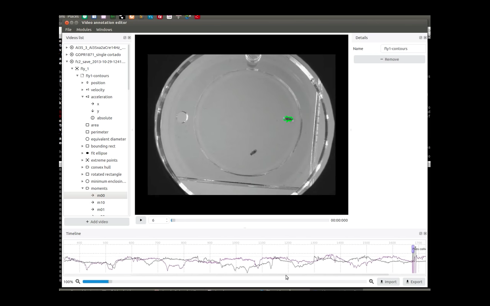

# Python Video Annotator

[Documentation on ReadTheDocs](https://pythonvideoannotator.readthedocs.io)


The software is an application written in python, which provides a GUI for users to analyse and to take notes of events occurred in the videos.

Features:
* Timeline for video navigation.
* Multiple events edition in the timeline.
* Graphs visualization over time.
* Objects tracking path edition.
* Plugins based app.

[](https://www.youtube.com/watch?v=9C4Zr8fhqFo&t=63s)


### Developers

* Ricardo Ribeiro - collaborator of the [Scientific Software Platform](http://neuro.fchampalimaud.org/en/research/platforms/staff/Scientific%20Software/) of the [Champalimaud Foundation](http://fchampalimaud.org).
* Hugo Cachitas working - collaborator of the [Innate Behavior Lab](http://neuro.fchampalimaud.org/en/research/investigators/research-groups/group/Vasconcelos/) of the [Champalimaud Foundation](http://fchampalimaud.org).
* Carlos Mão de Ferro - collaborator of the [Scientific Software Platform](http://neuro.fchampalimaud.org/en/research/platforms/staff/Scientific%20Software/) of the [Champalimaud Foundation](http://fchampalimaud.org).




## Installation & Running

How to install:

1. Install Python 3.6 from  [python.org](https://www.python.org/)

2. Install pypi from [pypi.org](https://pypi.org/)

3. Install PythonVideoAnnotator from Pypi:
```
pip install python-video-annotator
```

How to run:

```
start-video-annotator
```

### For developers:

[Follow the steps described here](https://pythonvideoannotator.readthedocs.io/en/master/user-docs/install_and_run/install_and_run.html#for-developers)


## Collaboration

This project was initially developed in collaboration with the [Innate Behavior Lab](http://neuro.fchampalimaud.org/en/research/investigators/research-groups/group/Vasconcelos/) to correct the result of a Computer Vision software to track flies in an arena
