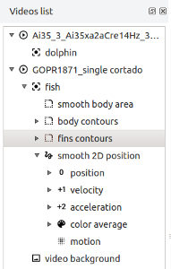
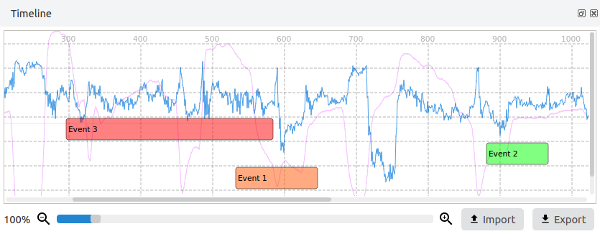
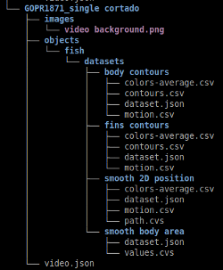
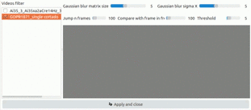

.. PythonVideoAnnotator documentation master file, created by
   sphinx-quickstart on Thu Jan 12 14:10:03 2017.
   You can adapt this file completely to your liking, but it should at least
   contain the root `toctree` directive.

.. toctree::
	:hidden:
	:maxdepth: 2
	:includehidden:
	:caption: Introduction
   
	VIDEO ANNOTATOR <self>

.. toctree::
	:hidden:
	:maxdepth: 2
	:includehidden:
	:caption: User guide

	user-docs/howto/index
	user-docs/timeline/index

.. toctree::
	:hidden:
	:maxdepth: 2
	:includehidden:
	:caption: Modules \ Plugins

	modules/tracking
	modules/regionsfilter	
	modules/extract-images
	modules/calc-background
	modules/smooth
	modules/path-map
	modules/distances
	modules/motion
	modules/export-videos
	modules/export-data
	
.. toctree::
	:hidden:
	:maxdepth: 2
	:includehidden:
	:caption: Concepts

	concepts/project-tree/index

|

PYTHON VIDEO ANNOTATOR
================================================

| 
| The python video annotator is a graphical application written in python, to analyse videos and mark events notes. It was developed with the aim of helping neuroscience and ethology researchers indentifing animals behaviours based on the information extracted from the video.
| 
| Paths, contours and outputs of external devices, like accelerometers, sound recorders, pokes, pressure devices and other sensors can be combined to find classes of events to identify behaviours.
| 

.. raw:: html

	

	<iframe width="100%" height="315" src="https://www.youtube.com/embed/9C4Zr8fhqFo?theme=light&modestbranding=1&autohide=1&showinfo=0&controls=1&rel=0&vq=hd1080" frameborder="0" allowfullscreen></iframe>
	

.. container:: separator
	
	.

|
|
| Organize your data and work on multiple videos at the same time with the project tree.
|
| Import the output of your scripts, third party applications or external devices, into your project and follow its changes over the time.
|
| On each video you may have associated objects that you can track and compare properties.

.. container:: clear-line
	
	.

|
| Navigate in the video, annotate and modify events with the timeline bar.
|
| Plot the data on the timeline to compare values over the time.
|

    

.. container:: clear-line
	
	.

|

|
| Access and modify easily the data with the open formats.
| 
| The project data is organized in a intuitive structure, and files are saved with open formats like json and csv to grarantee you the portability of the data.
|
| Modify the project structure by moving the folders around with your filesystem manager.

.. container:: clear-line
	
	.

|
| The python video annotator is plugins based which allow to toggle the activation of the ones that are already included or add new ones developed by you.
|
| Validate automatically tracking mistakes and correct them using the tracking modules or the manual correction.
|

.. image:: _static/index/player.png
	:class: paddingleft18

|
| Visualize the tracking information directly on the video player, smooth paths, calculate the videos' backgrounds and much more ...
|

.. container:: separator
	
	.

Installation & Running
-----------------------

- Download & install [Anaconda](https://www.anaconda.com/download/)
- Download [this repository](https://github.com/UmSenhorQualquer/pythonVideoAnnotator/archive/v2.0.zip) and uncompress it to a folder.
- Enter in the folder that you just uncompressed using the Terminal, and execute the next command: 

for mac:

.. code-block:: bash

	conda env create -f environment-macosx.yml
	source activate videoannotator
	python install.py

for windows:

.. code-block:: bash

	conda env create -f environment-windows.yml
	source activate videoannotator
	python install.py

Run
____

In the Video Annotator folder in the Terminal run:

for mac

.. code-block:: bash

	source activate videoannotator
	python -m pythonvideoannotator

for windows:

.. code-block:: bash

	source activate videoannotator
	python -m pythonvideoannotator

Developers
-------------------

=================================   ============================================================================================================================================
Ricardo Ribeiro                     from the `Champalimaud Scientific Software Platform <http://neuro.fchampalimaud.org/en/research/platforms/staff/Scientific%20Software/>`_
									ricardo.ribeiro@research.fchampalimaud.org
Carlos Mão de Ferro                 from the `Champalimaud Scientific Software Platform <http://neuro.fchampalimaud.org/en/research/platforms/staff/Scientific%20Software/>`_
									carlos.maodeferro@research.fchampalimaud.org
Hugo Cachitas                       from the `Innate Behavior Lab <http://neuro.fchampalimaud.org/en/research/investigators/research-groups/group/Vasconcelos/>`_
									hugo.cachitas@research.fchampalimaud.org
=================================   ============================================================================================================================================

|
|
